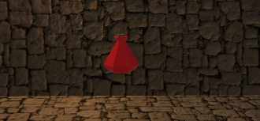
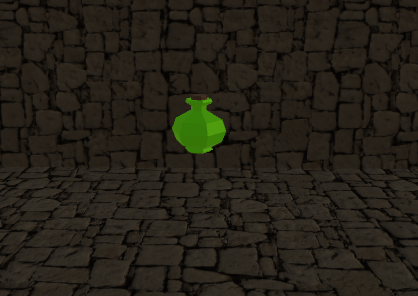
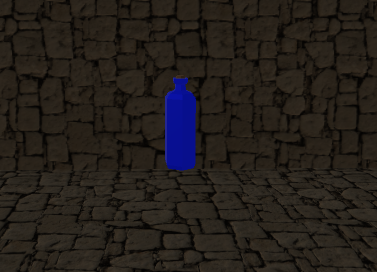
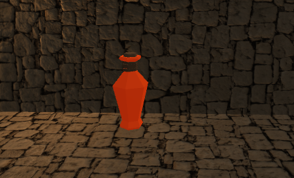
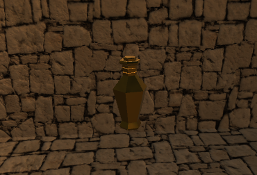
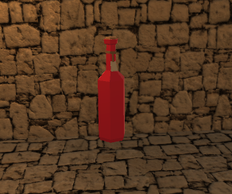
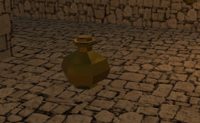
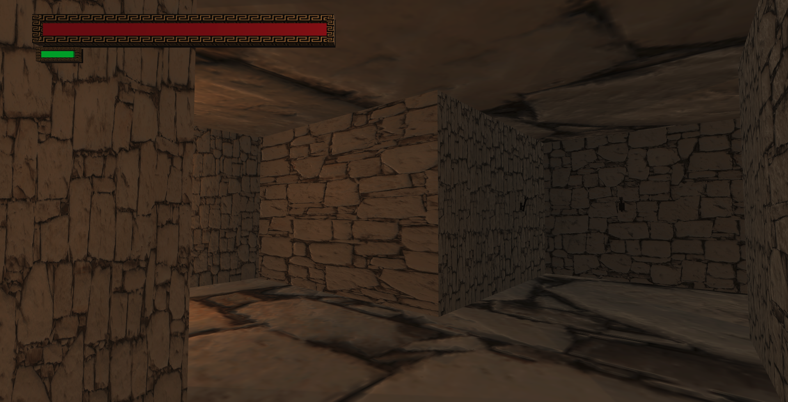
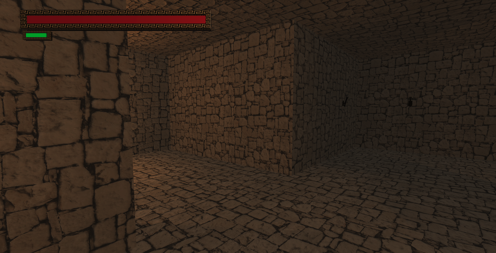

**The University of Melbourne**
# COMP30019 – Graphics and Interaction

## Teamwork plan/summary

<!-- [[StartTeamworkPlan]] PLEASE LEAVE THIS LINE UNTOUCHED -->

<!-- Fill this section by Milestone 1 (see specification for details) -->

###
11/09/2022 - 16/09/2022
###
Summary

We met as a team on 11/09 and 12/09  where we discussed our gameplay plan and how the game should look like.We discussed about the gameplay and mechanics which includes but were not limited to :

* Randomly generated maze
* Monsters 
* Items around (stat increases)   
* Goal: Kill minotaur
* Health bar
* Stamina
* Stats 
* Levels (each level is a new maze)
* Gets harder with each level
* left and right walls have different textures 
* 3d UI 
* Camera Orientation - FP with Free look 
* Vertical tunnel between each level
* Having render distance 
* tasked to kill the  minotaur
* sound effects

###
Teamwork plan 

* Start mostly by implementing mechanics with minimal visuals.
* These are the jobs we have allocated so far:
* Have frequent meetings with the team 
* Work in separate branches
* Ask for help when not sure
###

### TASK ALLOCATION  

### 12/09
* Labyrinth layout generation - Andrew
* Player controller - Rajneesh 
* Game pickups - Meaghan :)
* 3D models - Natasha

### 20/09
* 3D Models Animation - Natasha
* 3D UI - Andrew
* Title screen - Rajneesh

### 29/09

* Enemy logic - Andrew
* Particle systems - Natasha
* Still on title screen (partly done) - Rajneesh

### 06/10

* NavMeshSurface - Andrew
* Fixing animations and adding projectile - Natasha
* Add title screen and fix bugs - Rajneesh

### 14/10

* Observational tests and record findings.

### 21 /10
 
 * Querying method and record findings

### 21/10 - 31/10

* Add pause menu - Natasha
* Shaders - Natasha
* Make player take damage near Minotaur - Rajneesh
* Disperse enemies more evenly in maze - Andrew
* Increased pickups size - Natasha
* Add win screen when boss dies - Rajneesh
* Reduce attack cooldown and fix enemies health bar- Andrew
* Add boss music - Natasha
* Fixing bugs - Natasha, Andrew, Rajneesh
* Added about the game - Rajneesh
* Make enemies drop pickups and have the player shoot a ranged attack - Andrew

<!-- [[EndTeamworkPlan]] PLEASE LEAVE THIS LINE UNTOUCHED -->
## Final Report

### Table of contents

* [Game Summary](#game-summary)
* [How To Play](#how-to-play)
* [High Level Gameplay Decisions](#high-level-gameplay-decisions)
* [Graphical and Sound Assets](#graphical-and-sound-assets)
* [Graphics Pipeline](#graphics-pipeline)
* [Procedural Generation](#procedural-generation)
* [Particle System](#particle-system)
* [Querying and Observational Methods](#querying-and-observational-methods)
* [Changes from Participant Feedback](#changes-from-participant-feedback)

### Game Summary

The Minotaur is a mythical creature of great might, who had a labyrinth created around it just to contain its power. Every year the king sends nine of his greatest warriors to try and defeat the unstoppable beast and after forty winters, no mortal has yet had the power to defeat it.

Theseus, son of Aegeus and the undefeated champion of Greece, has taken upon himself the challenge of defeating the Minotaur. Our courageous champion has decided to face the beast alone. 

Traverse the labyrinth as Theseus, collect items and fight monsters, and delve deeper into the brink to finally kill the accursed beast.

### How to play

**Controls**  
Move: W, A, S, D Keys  
Jump: Spacebar  
Sprint: Left Shift Key  
Melee attack: Left Mouse Button  
Charge ranged attack: Hold Right Mouse Button  
Ranged attack: Release Right Mouse Button  
Pause: Escape Key  

**Gameplay**  
Walk into health items to heal  
Walk into stat increases to increase the corresponding stat  
Finish levels by falling down the hole  
Beat the game by reaching the final level and beating the Minotaur

### High Level Gameplay Decisions

**Camera View Choice**  
Our game is in first person view as it brings a more immersive experience and makes the game scarier since players will not know what is hiding behind a wall providing an element of surprise! 

**Enemies**  
We decided to put enemies into our maze to make the game more challenging for our players.

Enemies attack with projectiles since it’s simple to implement and enables the player to predict and dodge attacks as well.

Enemy AI uses the unity navigation mesh system for built in pathfinding. If an enemy has direct line of sight of the player, it stores the player’s last known position, and moves toward it.

**Stat System**  
We included a stat system in our game that makes the player stronger as the game progresses as throughout the levels, the number of enemies increases and the player will have to be stronger in order to progress.
 
The stat pickups are randomly placed in each level and players will have to explore the whole level if they want to get stronger.

There are 4 different types of stats: 
Health Stat which increases max health of the player

    

Stamina Stat which increases the max stamina of the player. When the player sprints, it consumes stamina in order to move at x1.5 speed.

    

Speed Stat which increases the speed of the player. 

    

StrengthStat which increases the strength of the player.

    

Ammo Stat which increases the maximum ammo capacity of the player. The player can hold right click to charge a ranged attack. Charging longer will deal more damage (quadratically) but consume more ammo (linearly), thus making it beneficial to fully charge the ranged attack."

    

Healing Item which refills the player's health.

    

Ammo Item which refills the player's ammo.

    

### Graphical and Sound Assets

No graphical & sound assets were custom made for this project. Refer to the references section for all the assets used in the game.

#### Explanations for asset choice

*Graphics*  
We chose graphical assets that fit the ancient Greek theme of the game. The texture of the walls and floor along with the torches on both sides of the walls are intended to fit the visual look of a labyrinth from that time. Two of the enemy models, the centaur and of course the minotaur, are figures from Greek mythology. The sword used is a 3d model replica of an actual ancient Greek sword. The borders of the UI health and stamina bars have a Greek patterned texture. The font used is also Greek-inspired. 

*Sound*  
Ominous background music was chosen to fit the foreboding and puzzling nature of the labyrinth. The enemies each have a unique damage sound effect in order for the player to clearly know which enemy they are attacking. A player damage sound effect was also added to give a clear indication of when the player was hurt along with the health bar decrease. Pickups have a sound effect to also clearly indicate to the player when they have been picked up.

### Graphics Pipeline
**World Space Texture Shader**  
The [World Space Texture Shader](Assets/Shaders/WorldSpaceTexture.shader) was created to solve the issue of distorted texture mapping on the walls of the maze due to their differing sizes.

*Distorted textures when using Standard Unity Shader*  

    

*Fixed when using World Space Texture Shader*  

    

Instead of mapping the wall textures to the object UV maps, the texture is mapped to world space. The side of the wall that the texture is mapped to is first determined by calculating the direction of the normal of the wall and then assigning UV coordinates accordingly.

Along with the conversion to world space, lighting was also manually implemented in the shader since it was required to be a vertex/fragment shader rather than a Surface shader. This involved adding diffuse lighting, ambient occlusion and specular lighting. The specular lighting is calculated using the Blinn-Phong model. The lighting is done in two passes in order to incorporate the effects of all the lights in the scene.

**Dissolve Shader**  
The [Dissolve Shader](Assets/Shaders/Dissolve.shader) is applied to enemies after they die to make them dissolve out rather than abruptly disappear when they are destroyed.

The shader works by sampling a noise texture, and then removing the pixels with a lower noise value (the darkest pixels in the noise texture). As time passes, the threshold for a pixel not being removed increases, until eventually all pixels have been removed. The randomness of the noise texture leads to a random-looking dissolve effect. The shader also incorporates different colours to look more interesting. Each colour has a different threshold that must be passed in order for it to be rendered, making the different colours merge into each other. In order to activate the shader only after the enemies die, a time variable is incremented from a script and its value passed into the shader.

### Procedural Generation

The game’s levels are multiple sections placed sequentially.
Each section has a maze inside, with walls between sections removed.

The first section of the level is always empty with a tube the player falls down from.
The last section of the level is always empty with a hole the player falls into to finish the level.

Mazes are generated using what is essentially a depth-first search in a 2D array of cells.
Each cell is initially set to have walls at every possible position. A random cell is selected to be the start for the search, and as the algorithm moves between cells, it marks that there should not be a wall between the respective cells. When the algorithm detects it cannot move between cells, it backtracks along the path it has taken to find a cell to enter.

Enemies, health items and stat increases have a set amount per section, and each category are placed independently of each other. They are placed inside the maze using a priority system on cells. Cells that are further away from previously placed entities are prioritised.

### Particle System
The particle system that is to be assessed is the [Fireball projectile](Assets/Prefabs/Fireball.prefab), which is shot by the enemies when they attack the player.

The fireball is a combination of 5 particle systems that each contribute a particular visual effect to the overall fireball, such as the base material, outer glow, smoke and sparks. For the base fireball, an explosion sprite sheet is animated over time to create a fire-like flickering effect. The Colour, Size and Rotation of the particle system are modified over their lifetime to make the fireball more dynamic. The trailing effect of the smoke and sparks are created by setting their Simulation Space to World. The different shape of the sparks to the rest of the fireball is done by setting its Shape to Cone.

### Querying and Observational Methods
The querying method used was a [survey](https://forms.gle/Kgf2RmmW5nw386xCA). 7 people participated, all between the ages of 18-22, with a fairly even gender split and varied gaming experience. The responses from our survey can be found <a href = "QueryResponses">here</a>

The observational method used was the Think Aloud method, with the participants being asked to vocalise their thoughts while playing, which were recorded and analysed. 5 people participated, all between the ages of 19-21, with a fairly even gender split and varied gaming experience.

Some of the main improvements that were suggested by participants from both the querying and observational methods:
* Make it clearer what each pickup does
* Make it easier to collect pickups
* Add a way to exit from the main game
* Add an incentive to kill enemies rather than just run around them
* Prevent enemies from spawning in one location rather than evenly distributed throughout the maze
* Make the final boss & enemies in general harder
* Reduce the time that the player has to wait before attacking again
* Enemy health bars are too high to see
* Add boss music to play during final level
* Add a ranged attack

### Changes from Participant Feedback
* Added text that is displayed when the player collects pickups to make it clearer what each pickup is supposed to be
* Made the pickup hit colliders larger so that the player can collect them more easily
* Added a pause menu where the player can view the game instructions again, exit to menu or quit the game
* Made enemies drop pickups when killed to give a greater incentive to kill them
* Updated the amount pickups increase by due to more pickups being spawned
* Made the enemies harder to run past by increasing their speed, and making their colliders no longer triggers
* Adjusted enemy spawning to be more evenly distributed throughout the maze
* Increased difficulty of final boss
* Reduced the player attack cooldown time
* Moved enemy health bars to be in front of enemy rather than above them
* Added boss music
* Added a charge-able ranged attack that shoots a bouncy ball.

### References

#### Packages
* [NavMeshComponents - Unity Technologies](https://github.com/Unity-Technologies/NavMeshComponents)
* TextMeshPro - Unity Technologies (Only available in the Unity Package Manager)

#### Assets
**Models**  
*Enemies*
* [Enemy 1](https://assetstore.unity.com/packages/3d/characters/insectoid-crab-monster-lurker-of-the-shores-20-animations-107223)
* [Enemy 2](https://assetstore.unity.com/packages/3d/characters/creatures/fantastic-creature-1-103074)
* [Enemy 3](https://assetstore.unity.com/packages/3d/characters/creatures/fantastic-creature-5-centaur-115204)
* [Enemy 4](https://p3dm.ru/files/characters/supernatural/4055-minotaur-.html) with animations done using https://www.mixamo.com/

*Items*  
* [Sword](https://sketchfab.com/3d-models/ancient-greek-sword-e2871dd65a6b4ed183e8b70c11a7ead7) 
* [Stat pickups](https://gualtierisgg.itch.io/3d-low-poly-potions-and-flasks)
* [Wall torch](https://assetstore.unity.com/packages/3d/environments/dungeons/decrepit-dungeon-lite-33936) 
* [Columns](https://assetstore.unity.com/packages/3d/environments/historic/classic-columns-58062)
* [Vase 1](https://www.cgtrader.com/free-3d-models/architectural/decoration/ancient-greek-amphora-059a033c-e175-4945-b75c-9d999277514a) 
* [Vase 2](https://www.cgtrader.com/free-3d-models/architectural/decoration/greek-vase-3c42ab16-3193-406e-ad19-1939ecc25206) 
* [Vase 3](https://sketchfab.com/3d-models/attic-skyphos-930dcf46606a406285244be7a4c6e496)
* [Death Icon](https://assetstore.unity.com/packages/3d/characters/humanoids/fantasy/skeleton-warrior-1-222338)

**Textures/Materials**  
* [Brick](https://assetstore.unity.com/packages/2d/textures-materials/brick/18-high-resolution-wall-textures-12567)
* [Skybox](https://assetstore.unity.com/packages/2d/textures-materials/sky/skybox-series-free-103633)
* [Grass](https://assetstore.unity.com/packages/2d/textures-materials/floors/yughues-free-ground-materials-13001)
* [Fireball](http://www.positech.co.uk/content/explosion/explosiongenerator.html)
* [UI Bar Border](https://www.istockphoto.com/se/vektor/greek-gold-frames-on-a-black-background-vector-gm1345903178-423827688)

**Fonts**  
* [Dalek Pinpoint Font](https://www.dafont.com/dalek-pinpoint.font)

**Sounds**
* [Game trailer music](https://www.youtube.com/watch?v=4yFqRpABTTw)
* [Game background music](https://www.youtube.com/watch?v=daCbyE6BwWQ)
* [BossBattleMusic](https://www.youtube.com/watch?v=n_8LAvwJMq8)
* [Sword slash](https://freesound.org/people/qubodup/sounds/184422)
* [Player damage](https://freesound.org/people/Christopherderp/sounds/342231/)
* [Player death](https://freesound.org/people/florianreichelt/sounds/412427/)
* [Enemy 1 damage](https://freesound.org/people/columbia23/sounds/395395/)
* [Enemy 2 damage](https://freesound.org/people/Darsycho/sounds/505185/)
* [Enemy 3 damage](https://freesound.org/people/qubodup/sounds/222130/)
* [Enemy 4 damage](https://freesound.org/people/StormwaveAudio/sounds/614068/)
* [Fireball](https://freesound.org/people/LiamG_SFX/sounds/334234/)
* [Stat pickup](https://freesound.org/people/plasterbrain/sounds/608431/)
* [Menu button click](https://freesound.org/people/Robinhood76/sounds/269259/)
* [Menu button hover](https://freesound.org/people/Leszek_Szary/sounds/146720/)

#### Learning resources
* [3D Ingame UI - Jimmy Vegas](https://www.youtube.com/watch?v=bbnVpPiQ_rU)
* [Maze Generation - The Coding Train](https://www.youtube.com/watch?v=HyK_Q5rrcr4)
* [Maze Generation - javidx9](https://www.youtube.com/watch?v=Y37-gB83HKE)
* [FPS Controller - Brackeys](https://www.youtube.com/watch?v=_QajrabyTJc)
* [Runtime Navmesh Generation - Unity](https://www.youtube.com/playlist?list=PLX2vGYjWbI0Rf0im34I2lBF4eufM-cgzQ)
* World Space Texture Shader:
    * [World Space Texturing](https://www.blog.radiator.debacle.us/2012/01/joys-of-using-world-space-procedural.html)
    * [Lighting & shadows](https://catlikecoding.com/unity/tutorials/rendering/)
    * [Texture mapping](https://docs.unity3d.com/Manual/SL-VertexFragmentShaderExamples.html)
* [Dissolve Shader](https://lindenreidblog.com/2017/12/16/dissolve-shader-in-unity)
* [Audio](https://youtu.be/6OT43pvUyfY)  
* [Fireball particle system](https://youtu.be/VpllBs22rHU)
